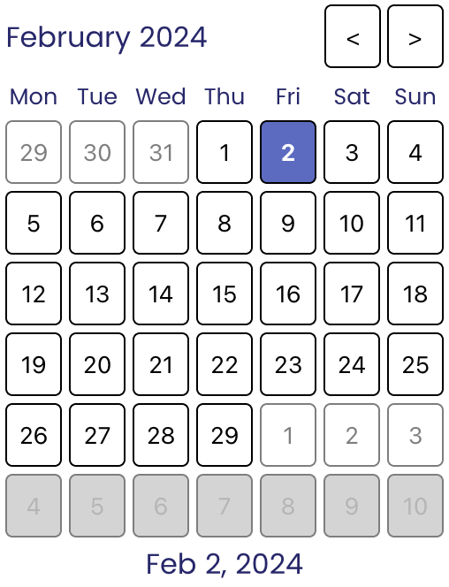

# datepicker.js

A date picker form control web component.

With this project my main goal was to better understand [Web Components] and especially [ElementInternals] to create custom form controls.

The first thing I learned that we cannot have nice things because of device and browser compatibility.

_Extending native elements is not an option._ The [`is`][is] global attribute which would let us extend native elements but Safari does not support it and probably never will. References: [Bug 182671](https://bugs.webkit.org/show_bug.cgi?id=182671), [WebKit/standards-positions#97](https://github.com/WebKit/standards-positions/issues/97).

_The datepicker should be an inline element._ Showing input dialogs is not recommended because on some devices like Android the back button/gesture is used to close them, and they navigate back in the browser history when a non-native input dialog is shown. There is [WICG/close-watcher] research which tries to address this problem but currently not available. [History API] could be used to create a similar behaviour, however, it is not easy and wasn't the goal of this research.

As usual, the best resources were [MDN Web Docs] and [web.dev]. There are a bunch of resources online which show how to create a date picker Web Component but most of them cannot be used as a form control, others show how to attach ElementInternals but then does not do anything with it.

My implementation is not perfect. I tried to separate the logic into three components, renderer, calendar, and HTMLElement. The renderers job is to draw and update the HTML DOM and to register event listeners. The calendar stores the state. Finally, the HTMLElement is only used to manage ElementInternals and expose some controls for users of the component.

Let me know if you would like to learn more about the implementation itself.

[Web Components]: https://developer.mozilla.org/en-US/docs/Web/API/Web_components
[ElementInternals]: https://developer.mozilla.org/en-US/docs/Web/API/ElementInternals
[is]: https://developer.mozilla.org/en-US/docs/Web/HTML/Global_attributes/is
[WICG/close-watcher]: https://github.com/WICG/close-watcher
[History API]: https://developer.mozilla.org/en-US/docs/Web/API/History
[MDN Web Docs]: https://developer.mozilla.org/en-US/
[web.dev]: https://web.dev/
